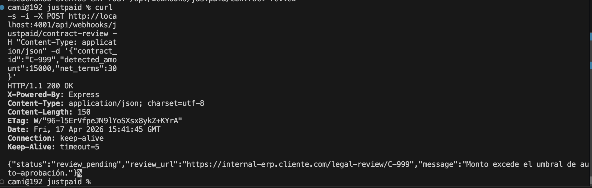

# 🚀 JustPaid Developer SDK & Webhook Boilerplate

Proof of Concept (PoC) demonstrating a developer-first approach to enterprise financial automation, bridging the gap between AI-driven contract analysis and CI/CD pipelines.

## Index
1. [Overview](#1-overview)
2. [Project Summary](#2-project-summary)
3. [Tools and Execution](#3-tools-and-execution)
4. [User Stories](#4-user-stories)
5. [Prototypes and Design](#5-prototypes-and-design)
6. [Project Planning](#6-project-planning)
7. [Result](#7-result)

---

### 1. Overview
The objective of this project was to design a robust, programmable layer over JustPaid's core AI engine. For enterprise clients with strict compliance requirements, adopting new financial tools can create friction. This architecture demonstrates how mid-market companies can implement human-in-the-loop approvals and custom business rules programmatically, reducing integration time from weeks to hours.

### 2. Project Summary
This boilerplate transforms JustPaid into a highly developer-friendly Revenue Ops platform by introducing two core concepts:
* **Declarative Workflow Engine:** Allows clients to define their billing processes via JSON, enabling their DevOps teams to integrate JustPaid directly into their CI/CD pipelines.
* **Contract-Review Hook System:** A webhook server implementation that receives payloads from JustPaid's AI and applies internal business logic (e.g., flagging high-value contracts) before authorizing the invoice creation.

### 3. Tools and Execution

**Technologies Used:**
* **Backend:** Node.js, Express.js.
* **Language:** TypeScript (for strict financial data typing).
* **Execution & DevOps:** `ts-node`, `tsc`, `nohup` (production simulation).

**🛠️ How to Run the Proof of Concept:**
Ensure you have Node.js installed. Clone the repository and install dependencies:

\`\`\`bash
npm install
\`\`\`

**Option A: Development Mode (Quick Start)**
Run the declarative engine to see the JSON workflow execution in your terminal:
\`\`\`bash
npx ts-node src/demo.ts
\`\`\`

Spin up the Webhook Server for local testing:
\`\`\`bash
PORT=3000 npx ts-node src/server.ts
\`\`\`

**Option B: Production-Ready Simulation (Compiled)**
To test how this would run in a real staging/production environment, compile the TypeScript code to JavaScript and run it via standard Node:

\`\`\`bash
# 1. Compile the code
npx tsc

# 2. Run the server in the background (simulating a production daemon)
PORT=4001 nohup node dist/server.js > justpaid-webhook.log 2>&1 &
\`\`\`
*(Note for production deployments: In a live environment, I would wrap this execution using a process manager like `pm2` or a Docker container orchestration strategy to ensure maximum uptime and log rotation).*

**🧪 Testing the Webhook Logic:**
Once the server is running, open a new terminal and simulate JustPaid's AI sending a parsed enterprise contract payload (triggering compliance rules):

\`\`\`bash
curl -X POST http://localhost:4001/api/webhooks/justpaid/contract-review \
-H "Content-Type: application/json" \
-d '{
  "contract_id": "C-999",
  "pdf_url": "https://s3.amazonaws.com/contracts/enterprise-deal.pdf",
  "detected_amount": 15000,
  "due_date": "2026-05-01",
  "net_terms": 30,
  "action_url": "https://api.justpaid.ai/actions"
}'
\`\`\`
*(Expected output: A JSON response with `status: "review_pending"` because the amount exceeds the $10,000 auto-approval threshold).*

### 4. User Stories
The architecture was designed to satisfy the following enterprise requirements:

- [x] As an Enterprise CFO, I want contracts over $10,000 to be automatically flagged for manual review before any invoice is issued.
- [x] As a Finance Ops Manager, I want Net-60 payment terms to require explicit approval to protect cash flow.
- [x] As a DevOps Engineer, I want to define billing workflows declaratively (JSON) to integrate JustPaid into our automated pipelines.
- [x] As a Backend Developer, I want a strongly typed Webhook SDK to safely receive and process financial payloads.

### 5. Prototypes and Design
Since this is a backend integration architecture, the "design" focuses heavily on Developer Experience (DX) and System Reliability:
* **Strict Typing:** Built with TypeScript to ensure data integrity across financial payloads and prevent runtime errors.
* **Fail-Fast Logic:** The workflow engine is designed to immediately halt execution if a critical condition (like an approval webhook) fails, preventing erroneous billing.
* **Event-Driven:** Mirrors best practices in scalable backend integrations, allowing asynchronous processing of heavy AI tasks.

### 6. Project Planning
The development was structured into three logical backend layers:
1.  **Data Contracts (`types.ts`):** Defining the strict interfaces for the incoming `JustPaidContractPayload` and outgoing `WebhookResponse`.
2.  **Compliance Controller (`webhookHandler.ts`):** Building the Express.js routing and the business logic to intercept and evaluate financial edge cases.
3.  **Declarative Engine (`WorkflowEngine.ts`):** Developing the parser that reads JSON configurations and executes sequential financial rules safely.

### 7. Result
Below is the successful interception of a high-risk enterprise contract via the local webhook simulation, validating the compliance logic:

